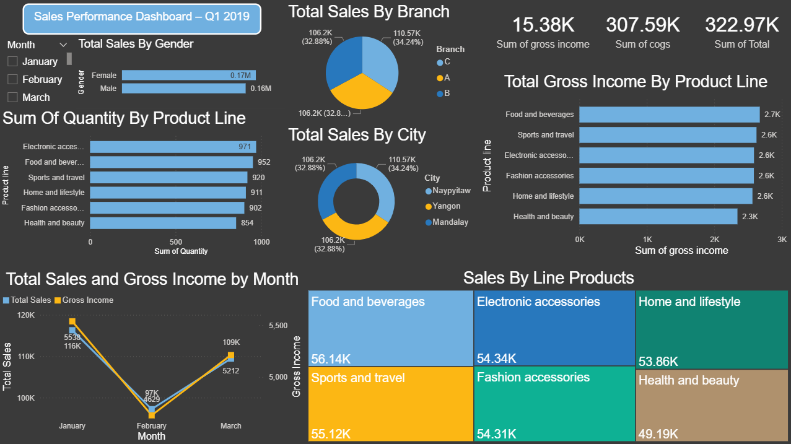
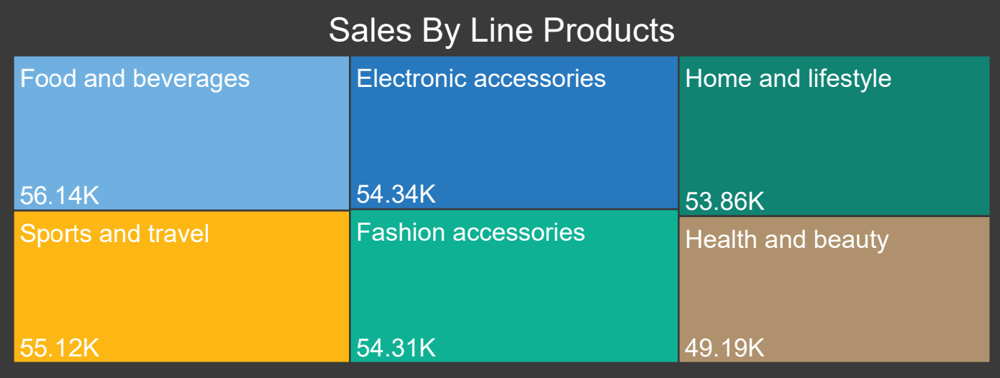
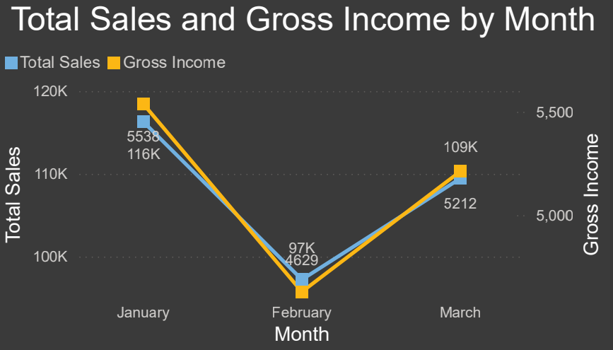
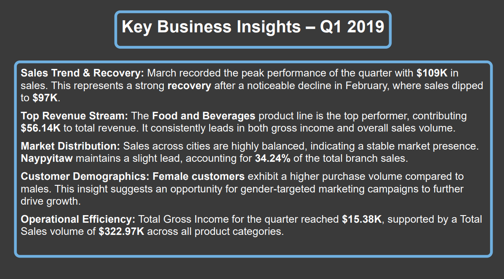

# 📊 Sales Performance Dashboard (Power BI) | Q1 2019

## 📝 Project Overview
This project presents an interactive **Power BI Dashboard** designed to analyze retail sales performance for the first quarter of 2019. The dashboard provides a comprehensive view of revenue trends, product line popularity, and customer demographics to support data-driven business decisions.

## 🎯 Objectives
* **Track Key KPIs:** Monitor Total Sales, Gross Income, and Cost of Goods Sold (COGS).
* **Trend Analysis:** Identify monthly sales fluctuations and recovery periods.
* **Product Performance:** Evaluate which product categories drive the most revenue.
* **Market Distribution:** Compare sales performance across different cities and branches.
* **Customer Insights:** Analyze purchasing behavior based on gender.

---

## 🛠️ Tools Used
* **Power BI:** Data visualization and interactive dashboarding.
* **Microsoft Excel:** Data source and initial processing.
* **DAX (Data Analysis Expressions):** For calculating measures like Total Sales and Gross Income.

---

## 📈 Key Business Insights (Q1 2019)

### 1. Financial Summary
* **Total Sales:** $322.97K
* **Total Gross Income:** $15.38K
* **Total COGS:** $307.59K

### 2. Sales Trend & Recovery
* **January:** Started strong with **$116K** in sales.
* **February:** Experienced a dip to **$97K**.
* **March Recovery:** Recorded a strong peak of **$109K**, showing a significant recovery.

### 3. Product Line Performance
* **Top Performer:** **Food and Beverages** leads with **$56.14K** in total revenue.
* **Highest Quantity:** **Electronic Accessories** recorded the highest sales volume with **971 units**.
* **Underperformer:** Health and Beauty recorded the lowest sales at **$49.19K**.

### 4. Market & Demographics
* **Top City:** **Naypyitaw** leads the market with **34.24%** of total sales ($110.57K).
* **Gender Analysis:** **Female customers** exhibit a higher purchase volume (**$0.17M**) compared to males (**$0.16M**), suggesting an opportunity for targeted marketing.

---

## 🖼️ Dashboard Preview

### **Main Dashboard Overview**

### **Sales by Product Line**

### **Monthly Trends & Gross Income**

### **Detailed Business Insights**

---

## 🚀 How to Use
1. Download the `.pbix` file from this repository.
2. Open it using **Power BI Desktop**.
3. Interact with the **Month slicer** to filter data for January, February, or March.
4. Hover over charts to see detailed tooltips and data points.

---

This project demonstrates end-to-end data analysis, from raw data preparation to actionable business insights.

**Developed by Gergess Magdy**  
*Feel free to reach out for any questions regarding the data model or visualizations!*

